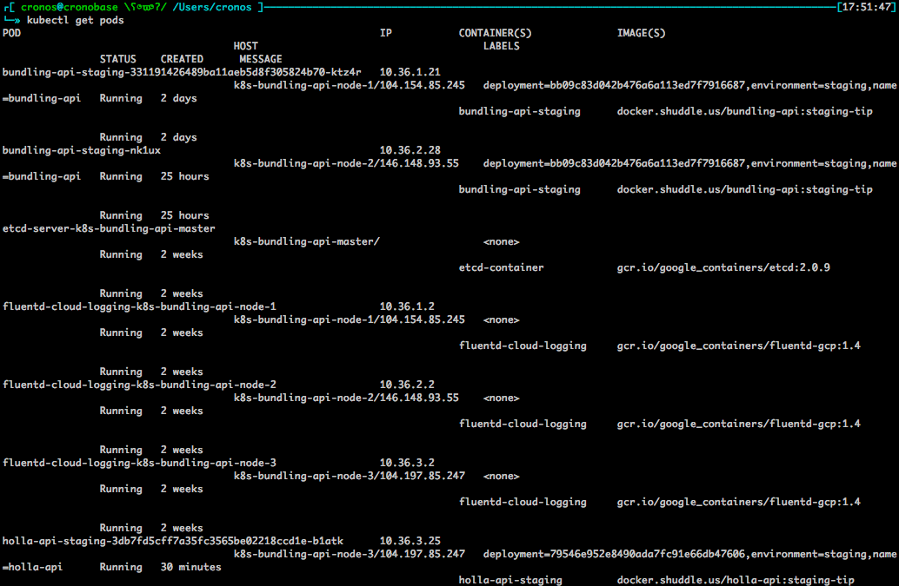
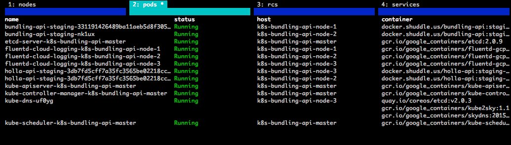

# kubeman - kubernetes management interface

kubeman is a [termbox](https://github.com/nsf/termbox) based tool for realtime monitoring and management of your kubernetes cluster.

It is intended to be used as a replacement for `kubectl` although it has a long way to go to match the functionality. First version of this tool will essentially be read-only.

## Installation

    go get github.com/alytvynov/kubeman

You need a working and relatively up to date version of go for this.

I run this tool against the latest release version of [kubernetes libraries](https://github.com/GoogleCloudPlatform/kubernetes) so you might need to check out a specific tag for it to work properly.

## But.. why?

Pretty much the difference between this:

And this:

## Debugging

If kubeman exits unexpectedly or has some other weird behavior, check ~/.kubeman.log file, it may contain some information.

If you find an issue, please create an issue in this repo, appreciate that.

TODO:

- status management (create, stop, resize, etc.)
- stats charts
- help page
